 

    

 

Blockreach
---

A modern Yellowpages for verified web3 individual and business profiles secured by the Onyx SSI sdk and Zksync smart contracts.

Built for the <a href="https://www.encode.club/digital-identity-hackathon" target="_blank">Encode digital identity hackathon 2023</a> in the FInance & Identity intersection category with B2B payments.

Live Demo (testnet, must be connected to Zksync Era): https://blockreach.vercel.app

Demo Video: https://youtu.be/cDBWfQlIDIg

Pitch deck: https://docs.google.com/presentation/d/1035CkshprHGTxbnC34WvWsWg7f7pEGAQudXiQFJ77x0/edit?usp=sharing

### Inspiration

Online partners and potential clients are constantly looking for ways to get in contact with a business or make themselves known. Blockreach addresses this need by enabling businesses to create their own secure contact pages, facilitating interactions via smart contracts managed through the Blockreach app. Furthermore, Blockreach enhances security by assigning Decentralized Identifiers (DIDs) and VCs to verified partners.

Accounts have an additional layer of security through Blockreach-issued DIDs and VCs for each verified partner on the app.

Blockreach serves as a bridge for secure B2B communication, ensuring that both parties can be confident they are contacting an authorized source. This assurance is achieved through Blockreach-issued verifiable credentials (VCs) and decentralized identifiers. Going after the Finance & Identity Intersection category.

### Live testnet app contract
https://goerli.explorer.zksync.io/address/0xcA5ce6dAe1156E7e222cD4c6BE35F6D343b11886

This contract is interacted with from the hosted testnet app linked above.

### Example profile with history
https://blockreach.vercel.app/profile/johndoe.lens

## Running the project (from scratch)

1. Generate a new Zksync contract for Blockreach by calling `yarn; yarn deploy` from the contracts folder. This will deploy the paymaster contract for the app.

2. Copy `.env.sample` -> `.env`

3. Define the the fields to your desired management and paymaster contract address from (1) in `.env`.

4. `yarn; yarn dev`. The app should now be running on port 3000.

5. Go to `localhost:3000/admin`. Connect your wallet using the same address from step 3.

6. Update the `issuer` credential found in `issuer.js`

7. Provision keys for handles using this page.

Any repeated starts can be done with `yarn dev` once all variables set.

## Technologies used

Blockreach pulls information from LENS to create a verified profile page for the business with contact information using Onyx and LENS. Zero/low fee interactions with the verified business account interactions facilitated with a paymaster ZkSync that refunds gas fees.

* <b>JPM Onyx sdk</b>: Social Identity Integration and Finance and Identity integration. The Onyx SDK is used for two key pieces. Most of the behavior of the app is server side, and contained in the `/api` provision and verify route folders (and in onyx.js within the github project)

1. Blockreach app has an admin issuer/verifier account that is run server side and used to validate new business page creations.
2. These server verifies all new page requests and generates unique DID and VC/VP keys that are saveable by each page owner.

* <b>Lens Protocol</b>: At its core, Blockreach works off Lens profiles to pull business pre-existing profile and reputation information (with recent activity) automatically. Using Lens enables landing pages without recreating information or social reputation from scratch.

* <b>ZkSync Paymasters and L2 Contracts</b>: Manages contract peer to peer transactions and auditable trail for all activities on the app. A master smart contract is deployed that manages metadata and the verifiable statuses for each business or entity on the platform. Payments and peer to peer outreach are also mediated through this contract between visitors to the app and the profile page account owners.

 
Note this project is a hackathon prototype and would require additional work to be mainnet ready.

## Challenges we ran into:

Verifiable Credential Issuance: It's critical that only legitimate businesses and individuals can register under a verified handle - this prompted creating a separate admin/issuer portal and due dilligence process managed with Onyx server side in order to prevent illegal claiming of profiles. The issued handle is embedded in the VC metadata and is cross checked and time of account claiming.

User Authentication/Verification: Implementing secure user authentication processes, especially for admin functions, required a high level of attention to detail to prevent unauthorized access.

Hackathon Time Constraints: As a prototype developed for a hackathon, there were time constraints that limited the depth of development and testing. This posed challenges in ensuring the platform's robustness.

## Accomplishments that we're proud of:

* Onyx Verifiable Credentials Implementation: Successfully implementing a system for issuing verifiable credentials that enhances the trustworthiness of interactions on the platform was a significant achievement.

* Successfully managed deployment and contract interactions on L2 testnet through ZkSync, enabling users to interact with businesses without incurring excessive fees, was a notable accomplishment.

* LENS Integration: Integrating with LENS to automatically populate business profile information and social history reduced the burden on businesses and improved user experience.

* Admin Functions: Creating an admin interface that allows for efficient verification of new business pages and the issuance of verifiable credentials demonstrated the platform's robustness.

## What we learned:

Blockchain Integration Complexity: Bridging transactions to L2 and ensuring seamless interactions with minimal fees and maintaining the security of smart contracts required careful consideration and expertise. Setting up Zksync required installing new toolkits and gaining additional familiarity with L2 networks and paymasters.

Identity Management: We gained valuable insights into identity management in the context of web3, particularly the importance of verifiable credentials and decentralized identifiers.

User Experience: Developing an intuitive and user-friendly interface for businesses and users in the web3 space is a unique challenge, and we learned valuable lessons in this regard.

### Deployment build

This project is currently deployed with vercel.

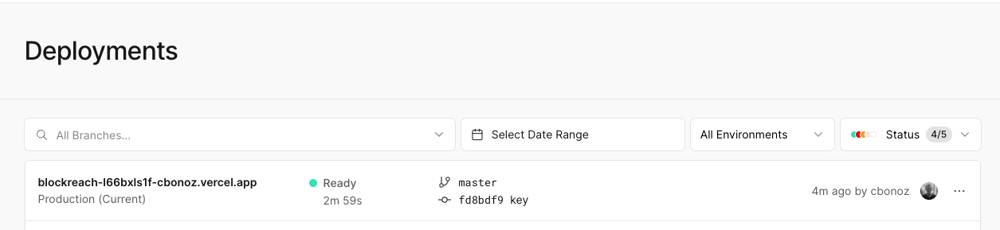

### Screenshots

These screenhots show different phases of the Blockreach application including a snippet of the primary contract, provisioning dids for users, and submitting inquiries for a verified account.

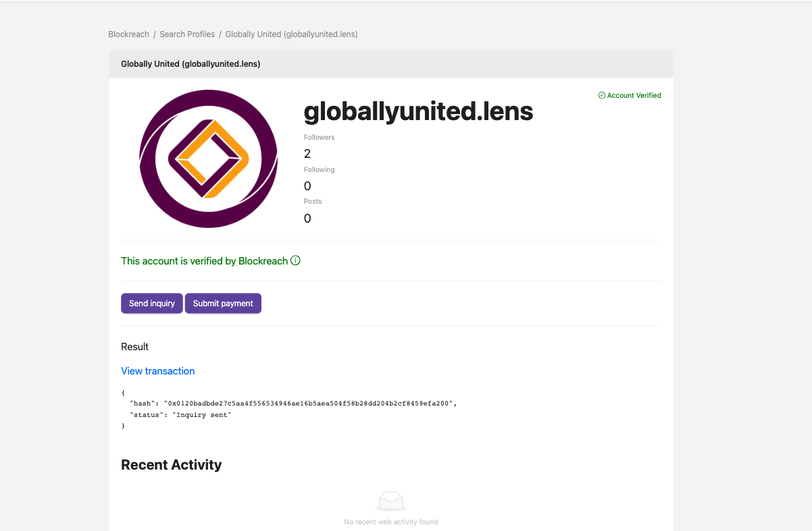 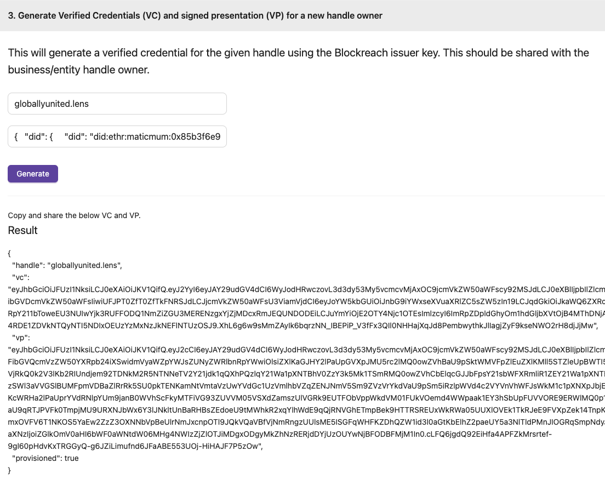 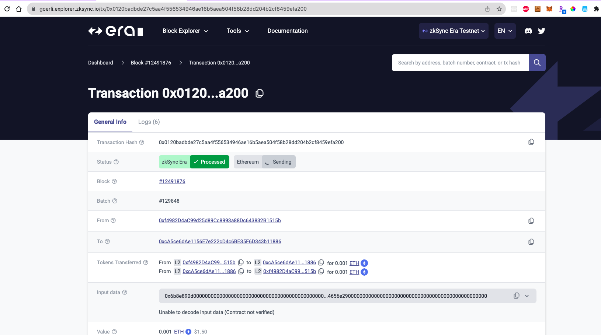 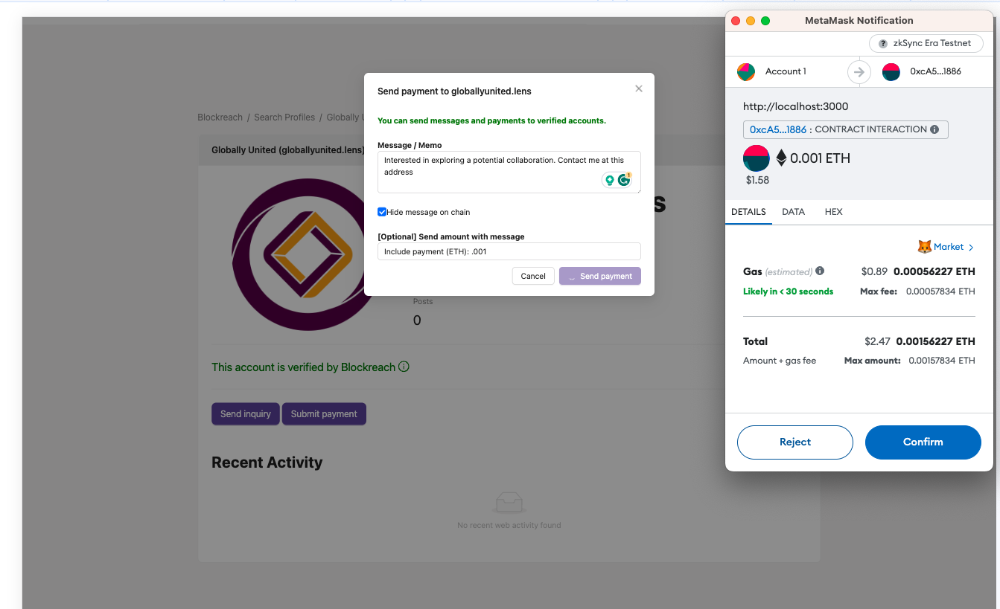 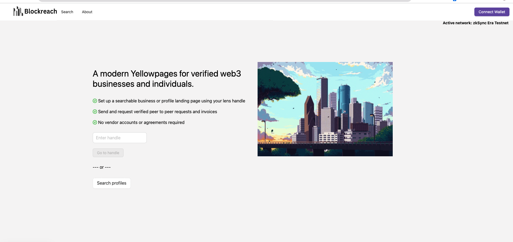 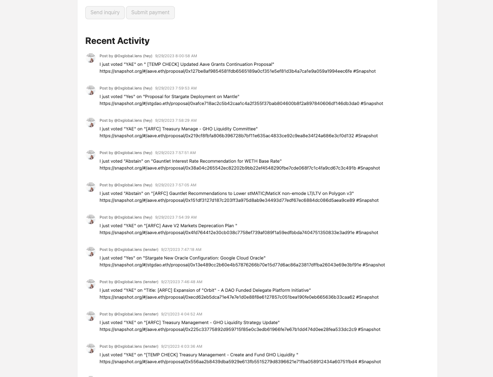 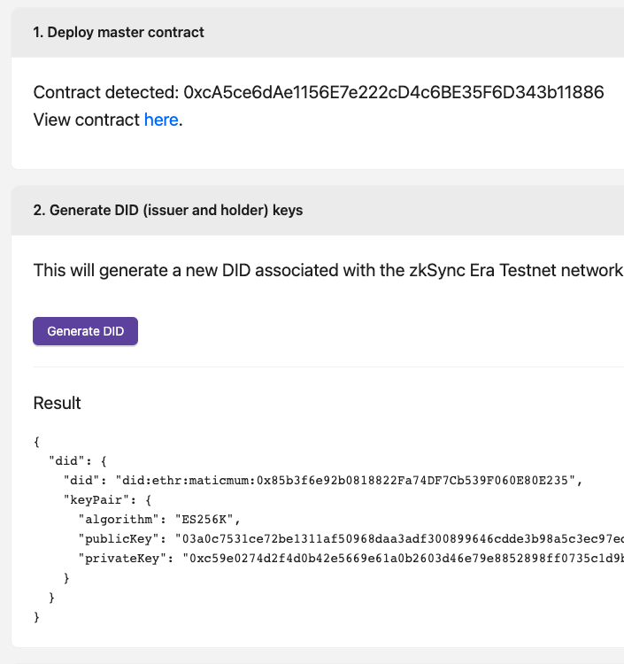 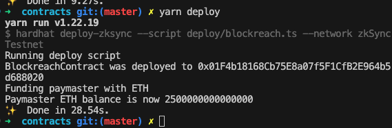 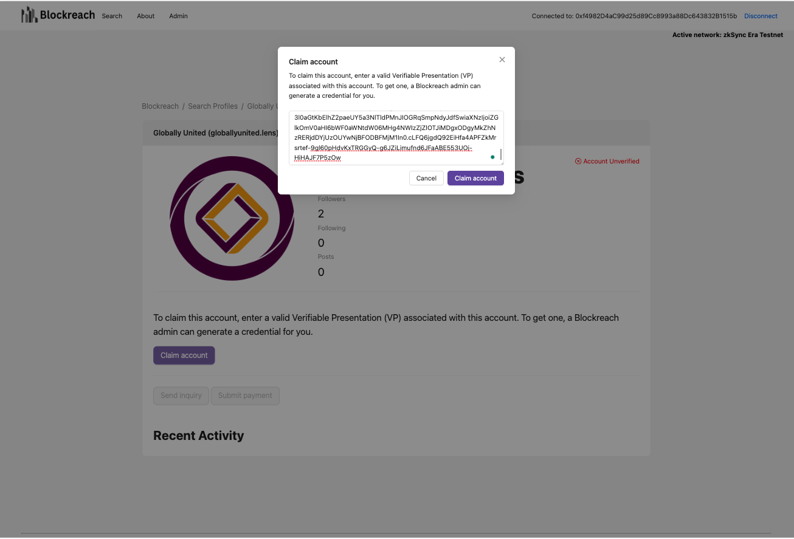 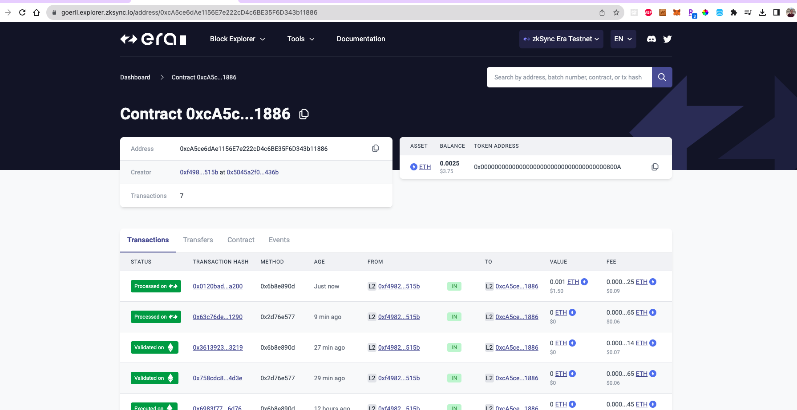 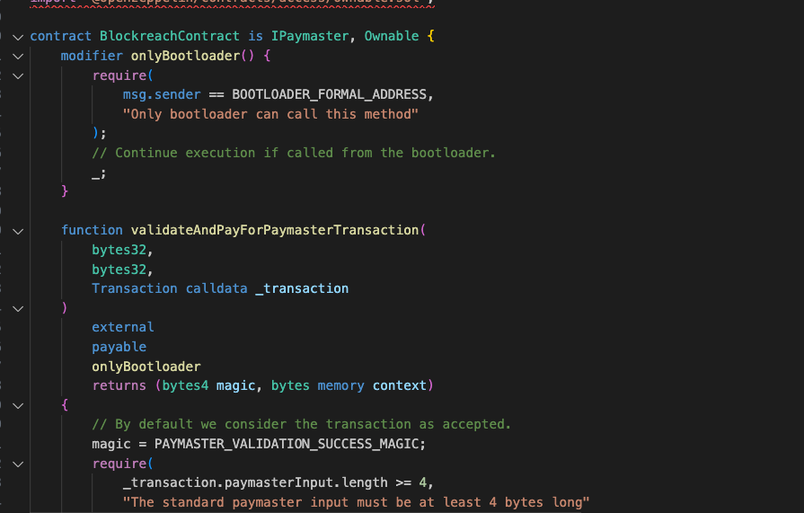
 

## Potential future work

Blockreach is an open source project and is deployed on testnet. To be mainnet ready, some final security-related changes would need to be done around contract verification and the hosted Onyx backend. Some other potential items include:

* Enhanced Security Measures: Implement advanced security features, such as multi-factor authentication and additional encryption layers, to fortify user data and interactions.
* Mainnet Deployment: Transition from the hackathon prototype to a fully functional and secure mainnet-ready platform for broader adoption.
* Integration with more identity and blockchain sources: Extend compatibility to multiple blockchains to provide users with options and flexibility when conducting verified transactions.
* Community Governance: Establish a governance model that empowers platform users to influence decision-making and ensure long-term sustainability between parties on the app.
* Incentives for use and reporting: Make it easy as possible to start generating leads on the application and tracking the performance of using a Blockreach page vs. traditional checks/fiat payments and public aggregator sites like Yellowpages.

<!-- https://github.com/andrewszucs/onyx-hackathon-zktoro/blob/896ccf4b72fffba305d9e263b7fcd243aefd5ae2/src/app/api/vc/route.ts -->
### Useful links

* https://www.encode.club/digital-identity-hackathon
* https://www.w3.org/TR/did-core/
* https://www.w3.org/TR/vc-data-model/
* https://era.zksync.io/docs/reference/concepts/account-abstraction.html#introduction